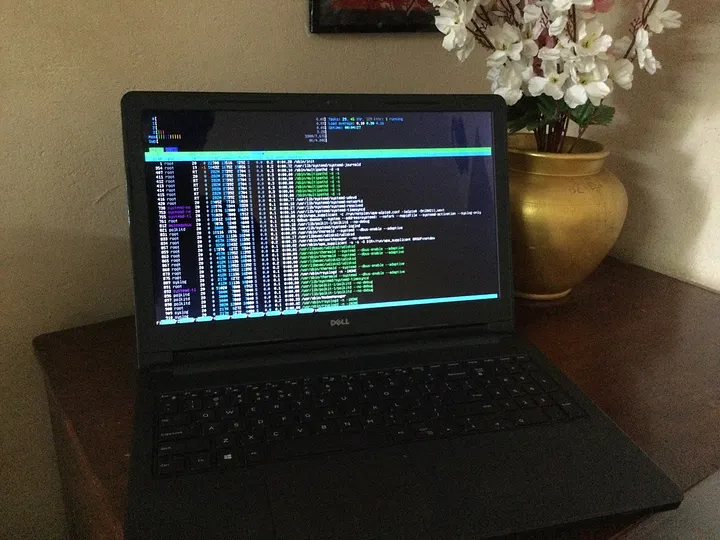
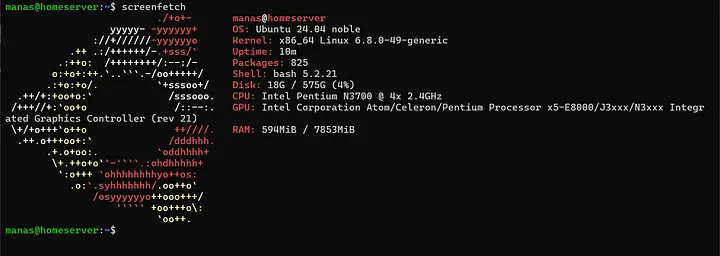
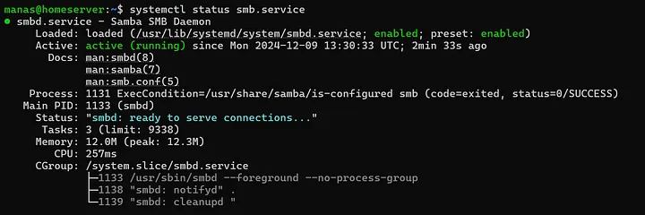
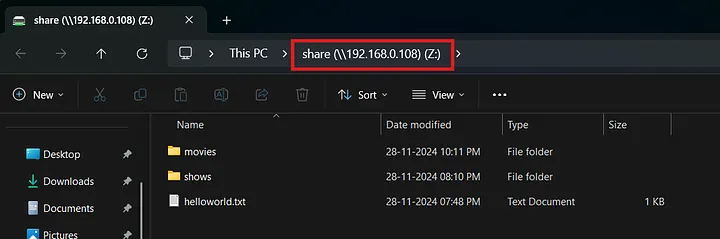
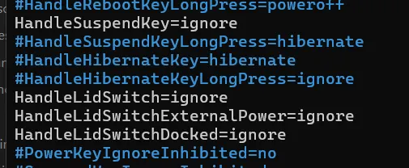
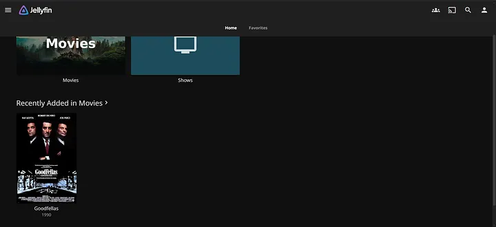

I’ve been using Linux as my daily driver for over five years now, and I’ve always been curious about how Linux operates as a server and what exactly a server entails. However, I never had the resources or the know-how to build my own server — until I got a shiny new laptop!

*The server in all its glory*

## Table of contents

## My Old Laptop

Meet my trusty old laptop:

- Model: Dell Inspiron 15
- RAM: 8 GB
- Processor: Intel Pentium Quad-Core
- 128 GB SSD and a 500 GB HDD

This old beast was basically gathering dust, so I saw it as the perfect opportunity to transform it into my very own home server. Here are the steps I followed to breathe new life into this ancient piece of tech.
## Installing Ubuntu Server LTS

First things first, I grabbed the latest LTS release of Ubuntu Server ISO from [here](https://ubuntu.com/download/server). I loaded it onto [Ventoy](https://www.ventoy.net/en/index.html) and booted up my laptop. The installation process is pretty straightforward. However, based on multiple sources online, I suggest not using Logical Volume Management (LVM) during disk partitioning. Also, I opted out of using Ubuntu Server Pro because I installed a bunch of extra packages that I would most definitely never use. 🤷‍♂️
## OpenSSH

OpenSSH is your best friend when it comes to logging into your server remotely. If you didn’t select it during the Ubuntu installation, you’ll need to install it manually.

```bash
ssh username@ip_address_of_server
```

*After the installation and login via SSH*

## SMB File Sharing Using Samba

I wanted to use this server as network storage, so setting up an SMB server was a must! Here’s how I did it:

1. Installing Samba

```bash
sudo apt install samba
```
   
2. Once that’s done, we need a directory `/media/share` to store the files we'll be sharing on the network. This setup can be quite involved, so I recommend following this guide from KalOS [here](https://chriskalos.notion.site/The-0-Home-Server-Written-Guide-5d5ff30f9bdd4dfbb9ce68f0d914f1f6#ad77305c83424605b859168b243ff81d).

   *Samba service running*
   
3. I had a secondary 500GB hard drive on my laptop which I formatted to ext4 using this guide on [Partitioning and Formatting Disks](https://www.cherryservers.com/blog/how-to-partition-and-format-disk-drives-on-linux).

   *Attaching the network storage on my windows pc*

## Disabling the Suspend on Lid Close Feature

Typically, when you close your laptop lid, it suspends the session and logs you out — super handy unless you’re trying to use your laptop as a server! Keeping the lid open takes up more space and consumes more power (thanks for the added electricity bill!). Luckily, there’s a simple fix:

1. Edit the `logind.conf` file:

```bash
sudo nano /etc/systemd/logind.conf
```

2. Change the values of `HandleSuspendKey`, `HandleLidSwitch`, `HandleLidSwitchExternalPower`, and `HandleLidSwitchDocked` from `suspend` to `ignore`.

   *logind.conf*
   
3. Restart the logind service:
   
   ```bash
   sudo systemctl restart systemd-logind
   ```

## Jellyfin Media Server 🎥

Jellyfin is a free and open-source media server designed to organize, manage, and stream digital media files across various devices. It allows users to host their own (legally acquired 😉) media libraries and access them remotely without any subscription fees or third-party dependencies. There are plenty of guides online on how to set up Jellyfin on your home server.

*Jellyfin UI*

And voilà! With all that set up, I now have my nifty little home server! 🎉 I’m also planning to set up WireGuard VPN on it and set up port forwarding so that I can access my server from anywhere in the world, but that’s a story for another day!

So there you have it — a little adventure in turning an old laptop into something useful! If you have any questions or want to share your own experiences, feel free to drop a comment below! 😄
