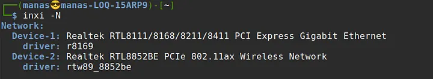

So here’s what happened.

I’m running **Linux Mint 22.1** with the **6.8.0 kernel** on my **Lenovo LOQ laptop**. Life is good — I’m coding, tinkering, and everything is smooth… or so I thought.

*My Network Specs*

But then, the Wi-Fi started acting up. Every 20–30 minutes, the connection would randomly drop. The only fix was to disconnect and reconnect manually, a process that took about half a minute — and even that didn’t always work.

Now, I can’t fully blame Linux or Mint for this. The real culprit was the notoriously unreliable **Realtek RTL8852BE** Wi-Fi card (also referred to as **RTW8852BE** — same hardware, different naming conventions). I’d had similar issues on Windows too, but at least Lenovo provides official Windows drivers that somewhat fix the problem there.
## Enter: The Community Driver

After some frustration-fueled Googling, I found a GitHub repository by [_lwfinger_](https://github.com/lwfinger/rtw8852be) that contains community-maintained drivers for the RTL8852BE chipset family.

I followed the instructions carefully and even applied additional tweaks for Ubuntu-based systems and Lenovo-specific quirks. The installation seemed to go well — the system could scan nearby networks. But every time I tried to **connect to an access point**, it just got stuck on “Connecting…” and never actually succeeded.

Annoyed, I decided to roll back and revert to the previous setup. I ran the uninstall script provided in the repository, which removed the custom driver. But suddenly, my Wi-Fi stopped working _entirely_.

## The Lesson Begins

Here’s where I learned two key concepts:
### 1. Linux Device Drivers = Kernel Modules

In Linux, most device drivers (including Wi-Fi drivers) are implemented as **kernel modules**. These are pieces of code that can be dynamically loaded into or unloaded from the running kernel — no need to reboot or recompile the entire OS.

- These modules typically have the `.ko` extension (short for kernel object).
- You can load a module using `insmod` or `modprobe`, and remove it using `rmmod`.
- This modular approach allows Linux to support a wide range of hardware on demand.

When I uninstalled the custom driver, I had unloaded its module — but I forgot to reload the **original kernel module** that supported my Wi-Fi card. Oops.

### 2. Blacklisting Kernel Modules

Sometimes, you may want to prevent specific kernel modules from loading automatically — maybe because they cause conflicts or aren’t needed.

This is done by **blacklisting** them in config files located in `/etc/modprobe.d/`.

For example:
```bash
# /etc/modprobe.d/blacklist.conf
blacklist rtw_8852be
```
 
This prevents the module from being auto-loaded at boot.
## More Research (and a Bit of Hope)

After digging through forums (like [this Arch Linux thread](https://bbs.archlinux.org/)), I learned that I could manually load the driver module using:

sudo modprobe rtw_8852be

Running `lsmod | grep rtw` confirmed it was loaded.

*Finally a breath of fresh air*

There’s also a known Launchpad bug (#2017277) about this Realtek chipset. Apparently, kernel 6.1 OEM had backported support for RTL8852BE from kernel 6.2 — which initially worked well but started regressing in later updates. So, I wasn’t alone.

I tried everything suggested — compiling drivers, manually loading modules, tweaking configs… and now?

The Wi-Fi **works perfectly on my college network** — but still **drops frequently on my home network**. And weirdly, all my other devices have zero issues on the same home Wi-Fi.

At least I got the Wi-Fi card functioning again… **sort of**. On the bright side, I no longer have to roam around with a Wi-Fi dongle sticking out of my laptop — so I’ll take what I can get. This fight isn’t over, I’ll come back again… stronger.
## TL;DR

- Realtek Wi-Fi cards (especially RTL8852BE) are a pain.
- Linux drivers = kernel modules. Learn to `modprobe`, `rmmod`, and manage them properly.
- Don’t forget to reload your original module after uninstalling a custom one.
- Sometimes, the fix doesn’t fix everything — but it’s still progress.